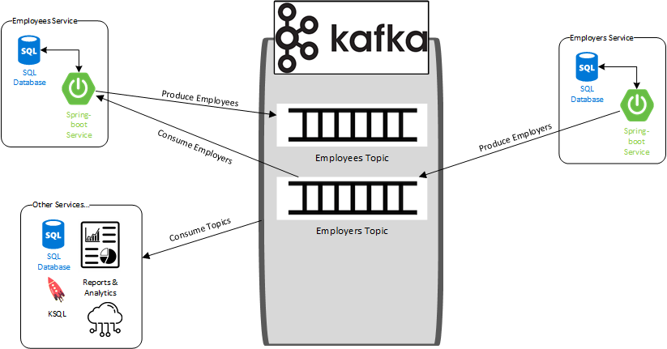

### First Part:

Start by `docker-compose up --build` from `/docker` folder.

**Check included postman collection for sample requests `prototype-collection.postman_collection.json`.**

> **Username: user**
>
> **Password: pass**

- Open API (http://localhost:8080/v3/api-docs/) & (http://localhost:8080/v3/api-docs.yaml)
- Swagger (http://localhost:8080/swagger-ui.html)
- Add Employee [POST](http://localhost:8080/api/employees/add)
- Update Employee Status [PUT](http://localhost:8080/api/employees/1/START_CHECK)

**Note:**
If you get authentication error when connecting to database, check if you have postgres installed on your computer.
If you do, you must disable the service before trying again.  

### Second Part:

> Suggest what will be your silver bullet, concerns while you're reviewing this part of the software that you need to make sure is being there.
I'd like to both automatic and manual reviews
- **Automatic Review:** 
    Using `SonarQube` or similar tools and integrating it into the pipeline in order to:
    - Scan the project code base regularly
    - Detect some of the issues/smells in the code
    - Assign the issue to the developers and keep track of them
- **Manual Review:**
    I usually add `TODO <developer-name>` comments in the code for each developer with my review notes and comments. 
    These are the main things that I look for when reviewing code: 
    - Review the code design to make sure it's well structure and use approperiate OO principal and/or design patterns when needed.
    - Check for code readability which include:
        - The code is well and consistently formatted.
        - Good names are used for all classes, methods, properties,.. and that naming conventions are followed.

> What the production-readiness criteria that you consider for this solution
- **Service Is Stable and Reliable**
    - Its code is thoroughly tested through lint, unit, integration, and end-to-end testing.
    - Its test, packaging, build, and release process is completely automated.
    - It has a standardized deployment pipeline.
    - Its development, staging, and production environemnts are as similar as possible.
- **Service Is Scalable and Performant**
    - Its resource bottlenecks and requirements have been identified.
    - Its dependencies will scale with it.
    - It will scale with its clients.
- **Service Is Fault Tolerant**
    - It has no single point of failure.
    - It is tested for resiliency through code testing, load testing, and chaos testing.
    - Failure detection and remediation has been automated.
    - Traffic can be re-routed in case of failures.
- **Service Is Properly Monitored**
    - Its key metrics are monitored at the host, infrastructure, and service levels.
    - It has appropriate logging that accurately reflects its past states.
    - There is a clear, well-defined, and standardized on-call procedure in place for handling incidents and outages.
- **Service Is Documented and Understood**
    - It's well documented.
    - Its documentation is updated regularly.
    - It is well understood at the developer, team, and organizational levels.
    - Its architecture is reviewed and audited frequently.

### Third Part:
> - Another Team in the company is building another service, This service will be used to provide some statistics of the employees, this could be used to list the number of employees per country, other types of statistics which is very vague at the moment.
> - Please think of a solution without any further implementation that could be able to integrate on top of your service, including the integration pattern will be used, the database storage etc.
> - A high-level architecture diagram is sufficient to present this.

Using Kafka as the main integration point for the system. Services consume topics populated by other services and also push to their own topics.
Kafka Streams and/or KSQL can be used to handle the data and generate the needed statistics and reports. 
 

